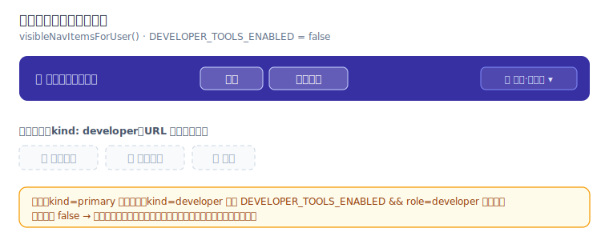
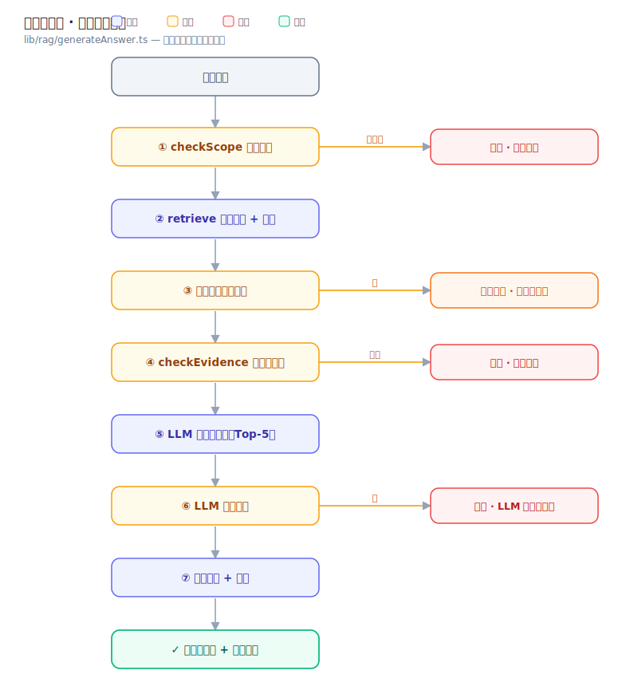
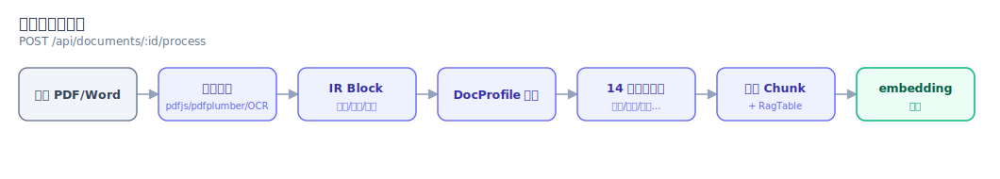
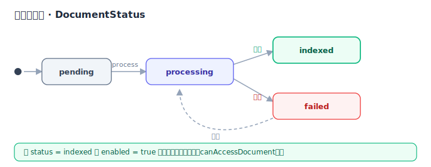

# 原型与流程设计｜企业知识库问答系统

> 阶段 3（原型/工作流）· 页面线框图 / 导航地图 / 交互流程 / 状态机
> 最后更新：2026-06-21 ｜ 关联：[PRD](./PRD.md) · [需求调研](./research.md)
>
> 线框图为低保真示意，组件命名对齐 `components/` 下实现。

---

## 1. 页面清单与导航地图

导航项由 `lib/knowledge/navigation.ts` 的 `visibleNavItemsForUser(currentUser)` 过滤；
每项有 `kind`：`primary`（始终显示）或 `developer`（仅当 `DEVELOPER_TOOLS_ENABLED && role===developer` 才显示）。
**当前 `DEVELOPER_TOOLS_ENABLED = false`，因此导航栏对所有角色只显示 `问答` 与 `文档管理` 两项**；
其余三页仍可通过 URL 直达，只是不在导航中。身份切换器由 `getSelectableKnowledgeUsers()` 提供（开发账号当前隐藏）。



下面的 ASCII 图保留**路由 ↔ 组件**的对应关系（视觉版见上图）：

```
┌──────────────────────────────────────────────────────────────┐
│ 🏛 规划设计院知识库      [问答] [文档管理]        👤 王磊·管理员 ▾ │  ← SiteNav（全局，当前仅2项可见）
└──────────────────────────────────────────────────────────────┘
        │
        ├── /            问答 (primary,显示)    ChatPanel              （全角色）
        ├── /documents   文档管理 (primary,显示) DocumentTable/Uploader（全角色可见，内容按ACL过滤）
        ├── /chunks      切分查看 (developer,隐藏) ChunkViewer
        ├── /debug       检索调试 (developer,隐藏) RetrievalDebugPanel
        └── /evaluation  评测 (developer,隐藏)    EvaluationManager/Table
```

> 注：`DEVELOPER_TOOLS_ENABLED=false` 是临时开关——`/chunks`、`/debug`、`/evaluation` 与开发账号
> 目前统一隐藏（见 `navigation.ts`、`DeveloperOnly.tsx` 及对应单测），后续放开后按 `developer` 角色显示。

---

## 2. 页面线框图

### 2.1 问答工作台 `/`（ChatPanel）
```
┌─ 城市规划与建筑设计院企业知识库 ───────────────────────────┐
│ 支持企业知识/行业标准/项目资料的可溯源问答；按账号权限过滤   │
├──────────────────────────────────────────────────────────┤
│ 示例问题: [二类居住用地是什么?] [绿地率不应低于?] [容积率上限?]│
│ ┌──────────────────────────────────────────────────────┐ │
│ │ 输入要查询的问题…                          📍当前城市   │ │
│ │                                          [清空][发送➤] │ │
│ └──────────────────────────────────────────────────────┘ │
├─ 回答区 (AnswerCard) ─────────────────────────────────────┤
│ 🛡 置信度: 高 · 多段依据交叉印证                            │
│ 【结论】 ……（LLM 抽取式，纯文字）                          │
│ ┌ 表格切片 (StructuredTableBlock) ─ 高亮命中行 ──────────┐ │
│ │ 用地代码 │ 容积率 │ 绿地率 │ … （来源:文件·页码）       │ │
│ └────────────────────────────────────────────────────┘ │
│ 【依据】 引用卡片 (CitationCard) ×N                        │
│   · 文件 / 章节·条款 / 页码 / 原文片段 / 相关度            │
│ 【注意】 适用范围声明                                       │
│                                          👍 有用  👎 没用   │
├─ 历史记录 (localStorage, 最多200条) ──────────────────────┤
│ • 之前的问答（可回看完整回答）                    🗑 清空    │
└──────────────────────────────────────────────────────────┘
```
**拒答态**（foundEvidence=false）：回答区替换为【无法确定】/【原因】/【建议】，无引用卡片。
**无权态**：替换为权限提示文案，无引用、不含原文。

### 2.2 文档管理 `/documents`
```
┌─ 文档管理 ────────────────────────────────────────────────┐
│ [⬆ 上传文档 (DocumentUploader: PDF/Word)]                  │
├─ DocumentTable ───────────────────────────────────────────┤
│ 文件名 │ 分类 │ 权限级 │ 项目归属 │ 状态 │ 检索开关 │ 操作    │
│ ……     │技术标准│ L1   │ —       │indexed│  ●开    │ ⚙ 🗑   │
│ ……     │项目资料│ L2   │滨江控规  │processing│ ○关  │ ⚙ 🗑   │
└──────────────────────────────────────────────────────────┘
  操作权限：管理员全量；负责人仅限自己负责项目的文档（canManageDocumentInManagement）
  列表可见性：按当前用户 ACL 过滤（canViewDocumentInManagement）
```

### 2.3 切片查看器 `/chunks`（ChunkViewer）
```
┌─ 选择文档 ▾ ──────────────────────────────────────────────┐
│ 文档: 某技术标准.pdf                                       │
├─ 知识单元列表 ────────────────────────────────────────────┤
│ #1  [条款] 章节路径 · 条号 · 页码                          │
│     原文内容……                                            │
│ #2  [指标] …    #3 [表格 RagTable] …    #4 [定义] …        │
└──────────────────────────────────────────────────────────┘
  展示 14 类结构化知识对象 + 切片原文
```

### 2.4 检索调试 `/debug`（RetrievalDebugPanel，开发可见）
```
┌─ 输入问题 → 调试检索 ─────────────────────────────────────┐
│ 关键词提取: [居住用地][容积率][上限]                        │
├─ 三路得分 ────────────────────────────────────────────────┤
│ chunk │ 精确索引 │ BM25 │ 向量 │ 重排后总分 │ 相关度       │
│ #A    │  1.0    │ 0.62 │ 0.71│   0.88     │ 高           │
├─ 重排维度 ────────────────────────────────────────────────┤
│ IDF短语 / 意图 / 版本时效 / 来源标题加权 …                  │
└──────────────────────────────────────────────────────────┘
```

### 2.5 题库评测 `/evaluation`（EvaluationManager / EvaluationTable）
```
┌─ 题库 ────────────────────────────────────────────────────┐
│ [导入题库 CSV/TSV/MD/XLSX]  [▶ 批量运行]  [⬇ 导出报告]      │
├─ 通过率: 86% (43/50) ─────────────────────────────────────┤
│ # │ 问题 │ 模拟账号 │ 期望 │ 实际 │ 通过? │ 命中依据/拒答原因│
│ 1 │ …   │ 张明·员工 │ 拒答 │ 拒答 │  ✅   │ 无权资料        │
│ 2 │ …   │ 王磊·管理 │ 作答 │ 作答 │  ✅   │ 文件·页码       │
└──────────────────────────────────────────────────────────┘
```

---

## 3. 核心交互流程

### 3.1 问答主流程（对应 `lib/rag/generateAnswer.ts` 六闸门）



### 3.2 文档入库流水线（POST /api/documents/:id/process）



---

## 4. 文档状态机（DocumentStatus）

类型定义见 `lib/types.ts`：`pending | processing | indexed | failed`。
仅 `enabled && status===indexed` 的文档进入检索（`canAccessDocument`）。



---

## 5. 组件 ↔ 页面映射（实现锚点）

| 页面 | 主组件 | 关键子组件 |
| --- | --- | --- |
| `/` | `ChatPanel` | `AnswerCard` · `AnswerBlocks` · `CitationCard` · `StructuredTableBlock` · `TableBlock` · `EmptyState` |
| `/documents` | `DocumentTable` | `DocumentUploader` |
| `/chunks` | `ChunkViewer` | — |
| `/debug` | `RetrievalDebugPanel` | `DeveloperOnly`（门禁） |
| `/evaluation` | `EvaluationManager` | `EvaluationTable` |
| 全局 | `SiteNav` | `KnowledgeUserProvider`（身份上下文） |

基础 UI 组件位于 `components/ui/`（button/card/dialog/select/table/tabs/textarea 等，Radix 封装）。

---

## 6. 交互设计原则
1. **可溯源优先**：每条结论旁必有可点回原文的引用卡片。
2. **三态分明**：作答 / 权限不足 / 无依据 文案与版式互不混淆。
3. **表格即真相**：表格数据由 `StructuredTableBlock` 渲染真实行列，绝不由 LLM 文字描述代替。
4. **身份显式**：当前模拟账号常驻导航栏，用户随时知道「我现在以谁的权限在查」。
